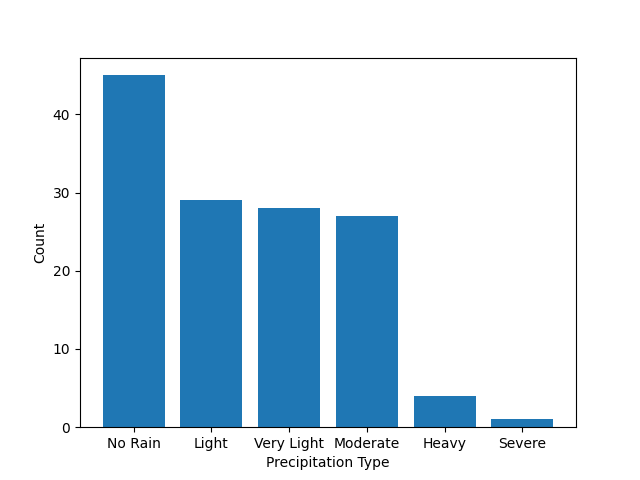
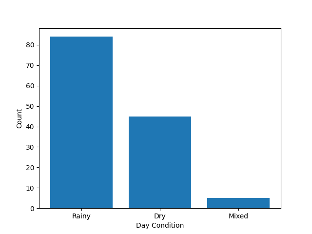

# Munich Weather Analysis and Visualization Project

This project uses Python, Pandas, and Matplotlib to clean, analyze, and create basic visualizations for a weather dataset from Munich, Germany (`munich.csv`).

## 📋 Project Report and Methodology

This project consisted of several key steps to move from raw data to meaningful insights.

### 1. Data Loading and Preparation

* **Dataset:** The `munich.csv` file was imported into a Pandas DataFrame using a semicolon (`;`) as the delimiter.
* **Copying:** Two copies of the DataFrame (`df_1` and `df_2`) were created to avoid losing the original data during analysis.

### 2. Data Cleaning

Two different data cleaning and preparation strategies were applied in this project:

1.  **For General Precipitation Analysis (`df`):**
    * Missing values (`NaN`) in the `precipitation_sum (mm)` (total precipitation) and `snowfall_sum (cm)` (snowfall) columns were treated as `0`.
    * This was done to include days with no precipitation in the analysis.
    * The columns were converted to the `float` data type for mathematical operations.

2.  **For Day Condition Analysis (`df_1`, `df_2`):**
    * To determine the daily condition (Dry, Rainy, Snowy, Mixed), data from both total precipitation and snowfall was needed.
    * Therefore, rows with missing data in *either* of these two columns were completely **removed** from the dataset using the command `df_1.dropna(how="any", inplace=True)`.
    * `df_2` was stored as a copy of this cleaned data.

### 3. Feature Engineering

Two custom functions were defined to create new categorical columns, making the raw data more understandable.

#### `weatherCondition` Function

This function takes the daily total precipitation amount (mm) and classifies it into standard weather categories:
* **No Rain:** 0 mm
* **Very Light:** 0 - 1 mm
* **Light:** 1 - 5 mm
* **Moderate:** 5 - 20 mm
* **Heavy:** 20 - 50 mm
* **Very Heavy:** 50 - 75 mm
* **Severe:** 75 - 100 mm

#### `dayCondition` Function

This function examines both total precipitation (x) and snowfall (y) to determine the "type" of day:
* **Dry:** If total precipitation and snowfall are 0.
* **Snowy:** If total precipitation is equal to snowfall (i.e., all precipitation is snow).
* **Mixed:** If total precipitation is greater than snowfall and snowfall is not 0 (i.e., there is both rain and snow).
* **Rainy:** All other cases (generally just rain).

### 4. Data Analysis and Visualization

The created categorical data was counted using `value_counts()` and visualized using bar plots with `matplotlib`.

* **Plot 1:** Shows the results of the `weatherCondition` function (Precipitation Type).
* **Plot 2:** Shows the results of the `dayCondition` function (Day Condition).

---

## 🚀 Project Outputs (Visualizations)

The plots obtained from the analysis:

### 1. Precipitation Type Distribution

This plot shows the distribution of days in the studied period according to precipitation intensity. The vast majority of the dataset shows "No Rain," followed by "Light" and "Very Light" precipitation.



### 2. Day Condition Distribution

This plot shows the distribution of days by weather condition (Dry, Rainy, Mixed). (Note: In the `df_2` dataset used to create this plot, "Snowy" days satisfying the `x-y==0` condition were not found, so they do not appear in the plot.)



---

## 🛠️ Setup and Usage

### 1. Clone the Repository

To download the project to your local machine, clone this GitHub repository:

```bash
git clone [https://github.com/Kerem-Oktr/weather-data-analysis](https://github.com/Kerem-Oktr/weather-data-analysis)
cd repo-name
```
### 2. Install Requirements:
Install the necessary Python libraries for the project to run using `pip`:
- pandas
- numpy
- matplotlib
```bash
pip install pandas numpy matplotlib
```
### 3.Run the Script:
With all files (especially `munich.csv`) in the same directory as `main.py`, run the script:
```bash
python main.py
```
When you run the script, two plot windows generated from the analysis will open.